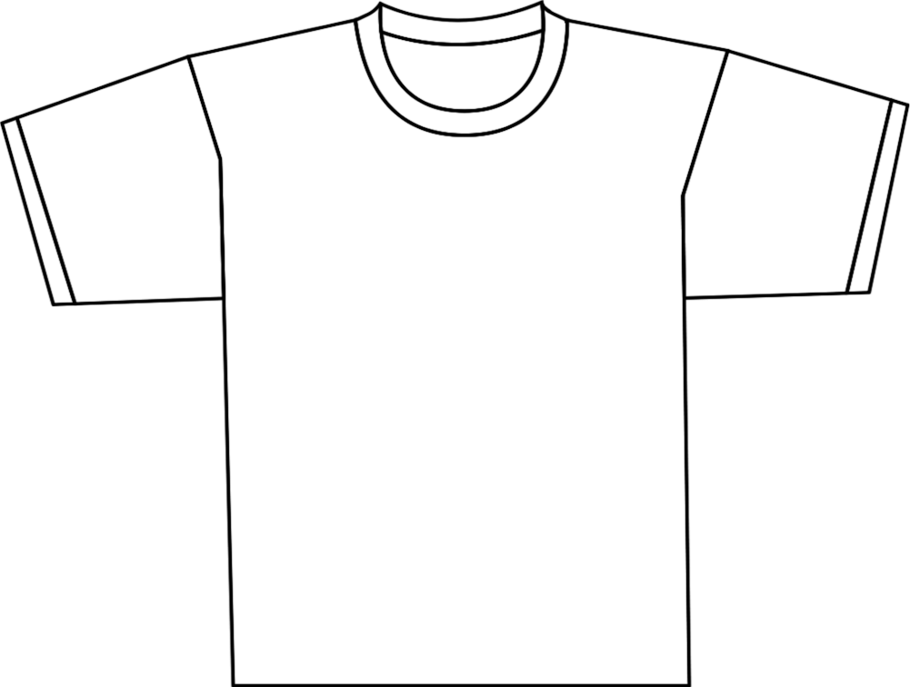
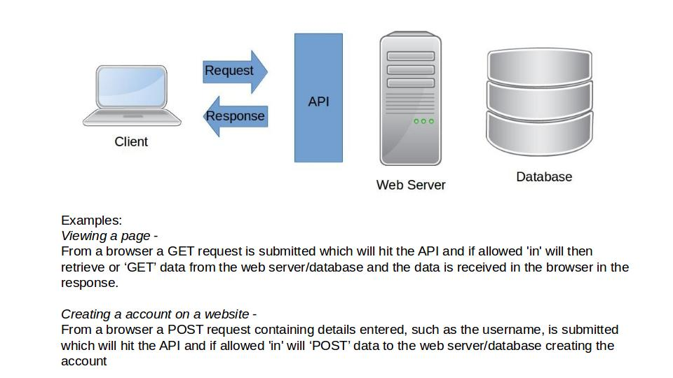
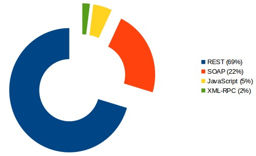
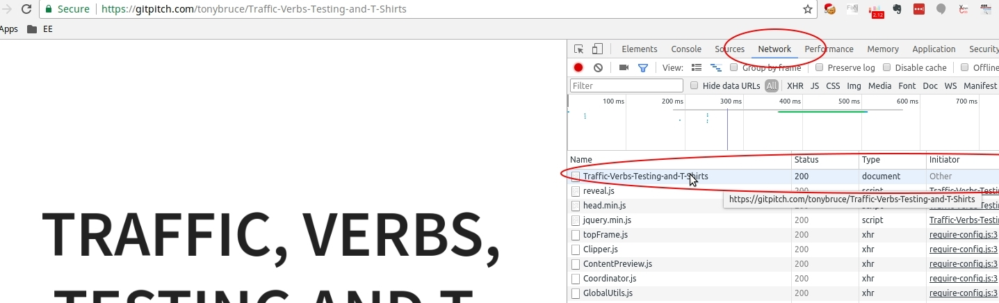
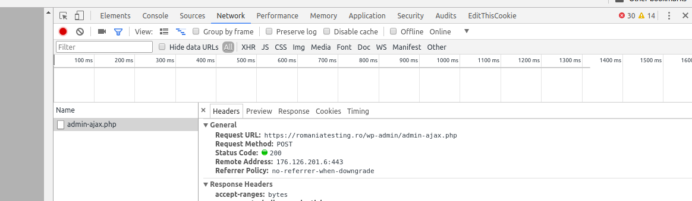
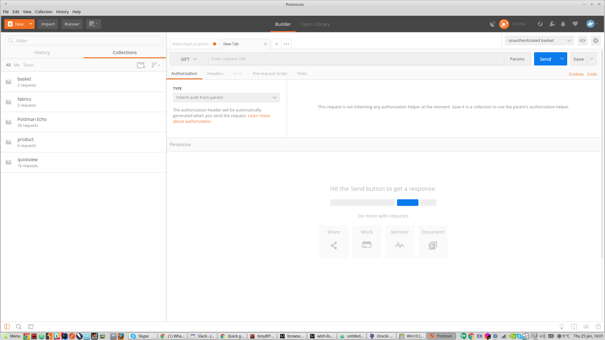
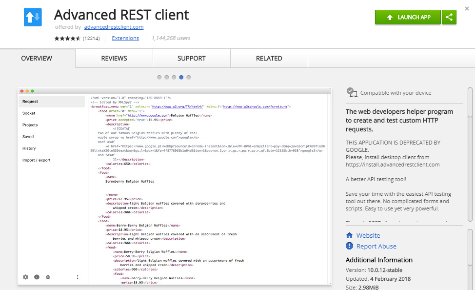
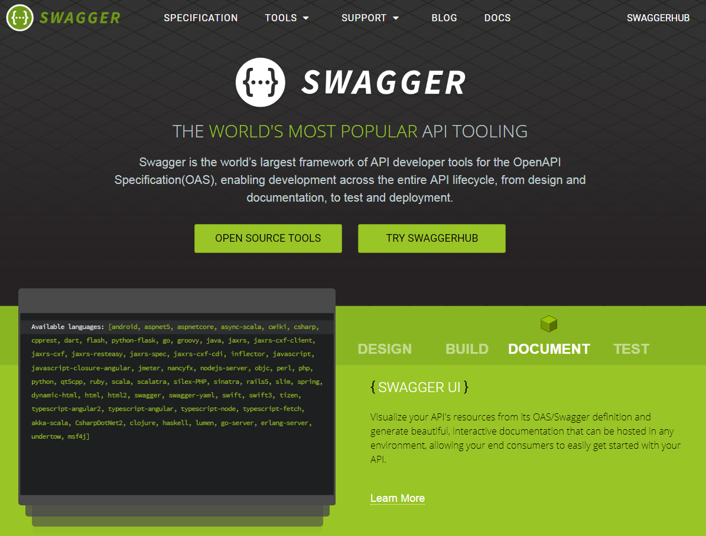

@title[Traffic, Verbs, Testing & T-Shirts]

---?image=assets/rtc_background.png&size=auto 90%

---

## Warm up

Whoosh!

Bong!

Tron!

---

@title[PITCHME.md]

## Agenda
* Where are we?  
* Quick overview of HTTP and REST API and what part they play  
* Introduction on how to start testing HTTP  
* Exercises to understand and test HTTP  
* Introduction to tools -  
    * Postman  
    * REST-Server  
    
+++?    
    * Curl  
    * WireMock
    * Swagger
    * Browser dev tools

And T-shirts  

---
## Where are we?

What is our current understanding and awareness of HTTP and REST APIs?

@fa[sticky-note fa-4x]@fa[sticky-note fa-4x]@fa[sticky-note fa-4x]@fa[sticky-note fa-4x]@fa[sticky-note fa-4x]
@fa[sticky-note fa-4x]@fa[sticky-note fa-4x]@fa[sticky-note fa-4x]@fa[sticky-note fa-4x]@fa[sticky-note fa-4x]

---
## Background: What are the technologies?

---
**Open Systems Interconnection (OSI) reference model**: is reference model for how applications can communicate over a network.
+++?image=assets/osiChuckNorris.png&size=contain

+++?image=assets/OSI.png&size=contain

+++?

**Application Layer** deals with the techniques that application programs use to communicate with the network  
**Presentation Layer** is responsible for converting the data sent over the network from one type of representation to another  
**Session Layer** establishes sessions (instances of communication and data exchange) between network nodes  

+++?

**Transport** is the basic layer at which one network computer communicates with another network computer. The Transport Layer is where you’ll find one of the most popular networking protocols: TCP  
**Network** handles the task of routing network messages from one computer to another. The two most popular Layer-3 protocols are IP (which is usually paired with TCP) and IPX (normally paired with SPX for use with Novell and Windows networks)  
**Data link** is the lowest layer at which meaning is assigned to the bits that are transmitted over the network  

+++?

**Physical** addresses the physical characteristics of the network, such as the types of cables used to connect devices, the types of connectors used, how long the cables can be, and so on  

---

**API**: Application Programming Interface is a set of subroutine definitions, protocols, and tools for building application software. In general terms, it is a set of clearly defined methods of communication between various software components

---

**Web API**: In simple words **web apis** enable communication between several machines


---

**HTTP**: HyperText Transfer Protocol is an application protocol for distributed, collaborative, and hypermedia information systems. HTTP is the foundation of data communication for the World Wide Web

---
**HTTP Verbs/Methods**: HTTP defines methods (sometimes referred to as verbs) to indicate the desired action to be performed on the identified resource. What this resource represents, whether pre-existing data or data that is generated dynamically, depends on the implementation of the server

---

**HTTP Headers:** carry information such as information about the client browser, the requested page, the server and etc

---

## HTTP Status Codes

**1xx** Informational responses

**2xx** Success

**3xx** Redirection

**4xx** Client errors

**5xx** Server errors

+++?

**100 Continue**
The initial part of a request has been received and has not yet been rejected by the server.
The server intends to send a final response after the request has been fully received and acted upon.

+++?
**200 OK**
Standard response for successful HTTP requests. The actual response will depend on the request method used.
In a GET request, the response will contain an entity corresponding to the requested resource. In a POST request,
the response will contain an entity describing or containing the result of the action.

+++?
**302 Found**
The target resource resides temporarily under a different URI. Since the redirection might be altered on occasion,
the client ought to continue to use the effective request URI for future requests. 

+++?
**404 Not Found**
The origin server did not find a current representation for the target resource or is not willing to disclose that one exists.

+++?S
**500 Interval Server Error**
The server encountered an unexpected condition that prevented it from fulfilling the request.

---

# EXERCISE


+++?

Your table needs to split into 3 parts:

Request/Response  
Client  
Server  

+++?
The t-shirts are the verbs 

One person wears the t-shirt

The correct verb has to be written on the t-shirt  

+++?

At the client create the request  
Each request needs -  
The URL
The correct verb  
Any body required  

+++?

Take the request to the server  
At the server create the response  
Each response needs -  
The correct status code  
Any body required  

+++?

There will be a decision made on correctness

---
## Challenge 1

Retrieve all conference types

---
## Challenge 2

Retrieve only `active` conference types

---
## Challenge 3

Retrieve the first conference type

---
## Challenge 4

Create a new conference type called `Open House` and make it `active`

---
## Challenge 5

Disable conference type `Workshop` 

---

## Challenge 6

Delete conference type `Workshop` 

---

## Debrief

What just happened?

What are we now aware of?

XML and JSON

+++?
## JSON

```[
    {
        "id": "01",
        "conference_type": "Workshop",
        "active": true
    },
    {
        "id": "02",
        "conference_type": "Talk",
        "active": true
    },
    {
        "id": "03",
        "conference_type": "Tutorial",
        "active": true
    },
    {
        "id": "04",
        "conference_type": "Keynote",
        "active": false
    }
]```

+++?

## XML

```

<?xml version="1.0" encoding="UTF-8"?>
<root>
   <element>
      <active>true</active>
      <conference_type>Workshop</conference_type>
      <id>01</id>
   </element>
   <element>
      <active>true</active>
      <conference_type>Talk</conference_type>
      <id>02</id>
   </element>
   <element>
      <active>true</active>
      <conference_type>Tutorial</conference_type>
      <id>03</id>
   </element>
   <element>
      <active>false</active>
      <conference_type>Keynote</conference_type>
      <id>04</id>
   </element>
</root>

```

---

## Break

During the break download
- Curl
- Postman
- Advanced Rest Client
- Burp Suite

---

**REST**: Representational State Transfer or RESTful web services are a way of providing interoperability between computer systems on the Internet. REST-compliant Web services allow requesting systems to access and manipulate textual representations of Web resources using a uniform and predefined set of stateless operations. 

---
**RESTful API**: A RESTful API is an application program interface (API) that uses HTTP requests to GET, PUT, POST and DELETE data.

---


---

**SOAP**: Simple Object Access Protocol is an XML-based messaging protocol. It defines a set of rules for structuring messages that can be used for simple one-way messaging but is particularly useful for performing RPC-style (Remote Procedure Call) request-response dialogues. 

---

**REST vs SOAP**:




source: https://blog.restcase.com/the-rise-of-rest-api/

---

## How does HTTP work?

Client-server* transactions consist of three main parts.
* A response or request line
* Header information
* The body

*meaning a computer system where a central server provides data to a number of networked workstations.

---

## A <span style="color:blue">_***request***_</span> or response line

The <span style="color:blue">_***request***_ </span> line has three parts - 
* A method name
* Local path of the requested resource
* The version of HTTP used

> GET /tonybruce/Traffic-Verbs-Testing-and-T-Shirts/master HTTP/1.1

<br>
---
## A request or <span style="color:blue">_***response***_</span> line

The <span style="color:blue">_***response***_ </span> line has three parts -
The version of HTTP used
A response status code 
English reason phrase which describes the status code


<span style="color:green">_***HTTP/1.1 200 OK***_</span>

---
## Header Information 
```
GET /tonybruce/Traffic-Verbs-Testing-and-T-Shirts/master HTTP/1.1
Host: gitpitch.com
Connection: keep-alive
Pragma: no-cache
Cache-Control: no-cache
Upgrade-Insecure-Requests: 1
User-Agent: Mozilla/5.0 (X11; Linux x86_64) AppleWebKit/537.36 (KHTML, like Gecko) Chrome/62.0.3202.94 Safari/537.36
Accept: text/html,application/xhtml+xml,application/xml;q=0.9,image/webp,image/apng,*/*;q=0.8
Accept-Encoding: gzip, deflate, br
Accept-Language: en-GB,en-US;q=0.9,en;q=0.8
Cookie: _ga=GA1.2.1473685318.1512492645; _gid=GA1.2.1103842518.1512492645; _gat=1
```
---

## GET  

<span style="color:blue">_***GET requests***_ </span> ask for data, and <span style="color:blue">_***do not change***_ </span> the data on the server  
<span style="color:blue">_***GET returns/responses***_ </span> are a representation in XML or JSON and a HTTP response code of <span style="color:blue">_***200 (OK)***_ </span> if everything is OK  
In an <span style="color:blue">_***error***_ </span> case, it most often returns a <span style="color:blue">_***404 (NOT FOUND)***_ </span> or <span style="color:blue">_***400 (BAD REQUEST)***_ </span>

---

## GET - Let's have a look

Launch dev tools in your browser:  
* Chrome - Shift + Ctrl + i  
* Firefox - Ctrl + Shift + k  
* Internet Explorer - F12
* Safari - Option + Command + i  

+++

Select the Network tab  
Browse to https://gitpitch.com/tonybruce/Traffic-Verbs-Testing-and-T-Shirts  
The first request should be the GET request for the page  
---

---
## POST

The <span style="color:blue">_***POST request***_ </span> is most-often utilised to <span style="color:blue">_***create***_</span> new resources
On successful creation, return <span style="color:blue">_***HTTP status 201***_</span>, returning a Location header with a link to the newly-created resource with the <span style="color:blue">_***201 HTTP status***_</span>
---
## POST - Let's have a look

Make sure the Network tab is still accessible  

Browse to https://romaniatesting.ro/  

Enter some details in the Contact Us form and Send it

You will see a POST request 

---



---

## Curl

  

https://curl.haxx.se/

curl is used in command lines or scripts to transfer data. 
It is also the internet transfer backbone for thousands of software applications affecting billions of humans daily.

+++?

In your terminal type: curl https://curl.haxx.se

---

## Postman


https://www.getpostman.com

Postman is a tool used to test APIs
It is used to interact with APIs through the requests and responses which are easy to create (in Postman)

+++?
Launch Postman (you may receive a short-cuts modal, close it).  

You will receive a window similar to this



+++?

## Creating a request

We are going to retrieve data so we are performing a GET request

In the ‘Enter request URL’ field enter:  https://postman-echo.com/time/now

Click Send

This retrieves current UTC time

+++?

The response (visible in the bottom half of the window) will contain a body with all the data we retrieved

There will also be a status code visible, if this request was successful it should display 200 OK

🛈 You may want to explore the Cookies and Headers to see what kind of information is there

+++?

Create a new request by using the New dropdown or the + symbol on the request tabs menu

+++?

## Creating a request for specific data

We are going to retrieve specific data by specifying query parameters in our request

We are going to check to see if this year is a leap year

In the ‘Enter request URL’ field enter:  https://postman-echo.com/time/leap?timestamp=2018-05-10

Click Send

2016 was the last leap year - Check this against the api

+++?

The response (visible in the bottom half of the window) will contain a body with the details exposed for 

There will also be a status code visible, is this request was successful it should display 200 OK

---

## Advanced Rest Client



---
## Burp Suite


https://portswigger.net/burp

A graphical tool for testing Web application security.

+++?

Instructions for setting up Burp Suite are here:
https://goo.gl/d8uiLM

You may need a certificate:
https://goo.gl/quCzbg

---

## Challenges

How would you change a request?

Change data in a request

+++?

How would you change a response?

Change the response code

---


## Swagger



https://swagger.io/

+++?

Examples: 

https://reverb.com/swagger#/categories

---

## Public APIs - Challenges

---

**Challenge 1**: Request the image for HTTP 500 from http.cat

Browse to https://http.cat/

Form the request needed

*Tool - What tool would you use?

+++?

Answer:
https://http.cat/[status_code]

---
**Challenge 2**: Request a "big" cover for the book "The Gruffalo" from https://openlibrary.org

Browse to https://openlibrary.org/dev/docs/api/books

Form the request needed

*Tool - What tool would you use?

+++?

*Format: https://openlibrary.org/api/books?bibkeys=ISBN:<>

*Documentation: https://openlibrary.org/dev/docs/api/books

**Tips - ISBN:0333710932
**Tips - https://covers.openlibrary.org/b/id/6506875-L.jpg

+++?

Answer: 2 possible approaches

1. Find the ISBN for the book from the web
2. Query by ISBN using format [https://openlibrary.org/api/books?bibkeys=ISBN:0333710932]
3. In the response returned use https://covers.openlibrary.org/b/id/6506875-S.jpg
4. Replace S with L
5. GET call to https://covers.openlibrary.org/b/id/6506875-L.jpg

+++?

1. Find the ISBN for the book from the web
2. From documentation learn adding & to the query by ISBN format [https://openlibrary.org/api/books?bibkeys=ISBN:0333710932&jscmd=data]
3. Look up for response "large": "https://covers.openlibrary.org/b/id/6506875-L.jpg"
4. GET call to https://covers.openlibrary.org/b/id/6506875-L.jpg

---
**Challenge 3**: Retrieve the page https://en.wikipedia.org/wiki/The_Lord_of_the_Rings

*Documentation - https://www.mediawiki.org/wiki/API:Query

*Tool - Of your choice

+++?

Answer - 
https://en.wikipedia.org/w/api.php?action=query&titles=The%20Lord%20of%20the%20Rings&export&exportnowrap

---

**Challenge 4**: Retrieve The Game of Thrones ebook details from Google books

*Documentation - https://developers.google.com/books/docs/v1/getting_started

*Tool - Of your choice

+++?

Answer - 
https://www.googleapis.com/books/v1/volumes?q=a+game+of+thrones&filter=ebooks&maxResults=1

---

**Challenge 5**: From iTunes retrieve the `track name - The Rains of Castamere` from `artist = Tina Guo`

[https://itunes.apple.com/us/album/the-rains-of-castamere-from-game-of-thrones-single/892454207]

*Tool - ARC (Rest Client)

+++?

*Documentation - 
https://affiliate.itunes.apple.com/resources/documentation/itunes-store-web-service-search-api/

**At times the documentation might suck. So google your way through to build the query?


+++?
Answer --> https://itunes.apple.com/search?term=The+Rains+of+Castamere+Tina+Guo&entity=song&limit=1 

(https://stackoverflow.com/questions/20378712/search-itunes-by-artist-and-song-title)

---
**Challenge 6**: Use chrome dev tools 'fetch' to find `How many people are in space right now`

+++?

Answer - fetch('http://api.open-notify.org/astros.json')
  .then(function(response) {
    return response.json();
  })
  .then(function(myJson) {
    

console.log(myJson);
  });
---

**Redmine**

Redmine is a flexible project management web application. Written using the Ruby on Rails framework, it is cross-platform and cross-database.
It has a UI
It has a api

API details are here: 

https://www.redmine.org/projects/redmine/wiki/Rest_api

http://www.redmine.org/projects/redmine/wiki/Rest_api_with_curl

+++?

## Scenario bash

Explore Redmine

- What would you like to test?
- What do you want to learn?
- What do you want to try?

+++?

IP Address | Username | Password
------------ | ------------- | -------------
18.130.47.124 | user | IJSViKfeUDX5
52.56.112.201 | user | uy4y0OVq2XVq
18.206.124.106 - First investigation is the find the usernames for this Redmine setup

These will be live for today only


---

## Round up

---

## References

**Mocking**
- Apiary [https://apiary.io/how-apiary-works]
- Wiremock [http://wiremock.org]
- JSON Server [https://github.com/typicode/json-server]

+++?

**API documentation**
- Swagger [https://swagger.io/]
- Spring REST Docs [https://docs.spring.io/spring-restdocs/docs/current/reference/html5/]
- RAML [https://raml.org/]

+++?

**Frameworks**
- Karate [https://github.com/intuit/karate]
  - https://blog.testproject.io/2017/08/21/api-testing-karate-framework/
  - https://hackernoon.com/api-consumer-contract-tests-and-test-doubles-with-karate-72c30ea25c18

+++?

**:Reference:**
- https://stackoverflow.com/questions/5757864/structuring-online-documentation-for-a-rest-api 
- http://www.drdobbs.com/web-development/restful-web-services-a-tutorial/240169069 
- https://github.com/typicode/json-server 
- http://www.restapitutorial.com/ 
- https://any-api.com/ 

+++?

- http://dasunhegoda.com/rest-api-architecture-best-practices/1049/ 
- https://www.whoishostingthis.com/resources/http-status-codes/ 
- https://httpstatusdogs.com/
- http://www.dummies.com/programming/networking/layers-in-the-osi-model-of-a-computer-network/
- https://httpstatuses.com/ 
- https://blog.developer.sabre.com/blog/2016/04/13/rest-vs-soap/
